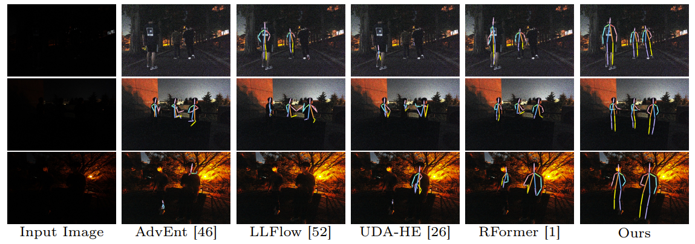

# Domain-Adaptive 2D Human Pose Estimation via Dual Teachers in Extremely Low-Light Conditions



## Introduction
This is the official repository for the ECCV'24 paper: Domain-Adaptive 2D Human Pose Estimation via Dual Teachers in Extremely Low-Light Conditions.

## Environment
The code is developed using python 3.11.8 on Ubuntu 20.04, and our model is trained on four NVIDIA RTX 3090 GPUs. Other platforms have not been fully tested.

## Quick start
### Installation
1. Clone this repo, and we'll call the directory you cloned as ${POSE_ROOT}.
2. Install dependencies:
```
   pip install -r requirements.txt
```
3. Install [CrowdPoseAPI](https://github.com/Jeff-sjtu/CrowdPose).
   Different environments may affect the installation of the API. In our case, we use the following command. (Note: You may encouter an AttributeError when using CrowdPoseAPI due to deprecated numpy features, just follow the prompted instructions and make changes should be fine.)
```
   pip install -e .
```
4. Create output (training model output directory) and log (tensorboard log directory) directories:

```
   mkdir output 
   mkdir log
```
5. Download our pretrained models from ([GoogleDrive](https://drive.google.com/drive/folders/1QDI60Fs1QoDDNviU4WPKSxga0PKcsKGd?usp=sharing)) and make model directory look like this:
```
    ${POSE_ROOT}
    |-- model
    `-- |-- imagenet
        |   `-- hrnet_w32-36af842e.pth
         `--exlpose  
            `-- model_final.pth
```
   
### Directory Tree
Please organize your project directory tree as follows:
```
   ${POSE_ROOT}
   ├── model
   ├── experiments
   ├── lib
   ├── tools 
   ├── output
   ├── README.md
   └── requirements.txt
```

### Data preparation

**For ExLPose data**, please download from [ExLPose download](http://cg.postech.ac.kr/research/ExLPose/).
Extract them under {DATASET_ROOT}, and make them look like this:
```
   ${DATASET_ROOT}
   |-- Annotations
   |   |-- ExLPose_test_LL-A.json
   |   |-- ExLPose_test_LL-E.json
   |   |-- ...
   |    `-- ExLPose_train_WL.json
   |-- ExLPose
   |   |-- bright
   |   |   |-- imgs_0119_3_vid000002_exp100_bright_000052__gain_0.00_exposure_1000.png
   |   |   |-- ...
   |   |   `-- imgs_0212_hwangridan_vid000021_exp1200_bright_000092__gain_28.18_exposure_417.png
   |    `-- dark
   |        |-- imgs_0119_3_vid000002_exp100_dark_000052__gain_0.00_exposure_1000.png
   |        |-- ...
   |        `-- imgs_0212_hwangridan_vid000021_exp1200_dark_000092__gain_6.60_exposure_417.png
   `-- ExLPose-OCN
       |-- A7M3
       |    |-- 0822_DSC07102.JPG
       |    |-- ...
       |    `-- 0829_DSC08058.JPG
       `-- RICOH3
            |-- 0825_R0000208.JPG
            |-- ...
            `-- 0829_R0000662.JPG
```          
### Testing
Note that the default testing configuration uses 4 GPUs. Please adjust this according to your machine’s specifications. 

#### Testing on ExLPose-test LL-A split

```
   python tools/valid_test.py --cfg experiments/exlpose/test_config.yaml \
       TEST.MODEL_FILE model/exlpose/model_final.pth DATASET.ROOT ${DATASET_ROOT} \
            TEST.NMS_THRE 0.15 TEST.SCALE_FACTOR 0.5,1,2 TEST.MATCH_HMP True DATASET.TEST all
```

Set DATASET.TEST to 'normal', 'hard' or 'extreme' to evaluate on LL-N, LL-H and LL-E splits.

#### Testing on ExLPose-OCN RICOH3 split

```
   python tools/valid_ocn.py --cfg experiments/exlpose/test_config.yaml \
       TEST.MODEL_FILE model/exlpose/model_final.pth DATASET.ROOT ${DATASET_ROOT} \
           TEST.NMS_THRE 0.15 TEST.SCALE_FACTOR 0.5,1,2 TEST.MATCH_HMP True DATASET.TEST RICOH3
```

Set DATASET.TEST to 'A7M3' to evaluate on A7M3 splits.

#### Training on ExLPose
Pre-Training Stage: Training the main teacher on well-lit image
```
   python tools/train_stage1_PT.py --cfg experiments/exlpose/PT_stage_config.yaml \
       DATASET.ROOT ${DATASET_ROOT}
```

Pre-Training Stage: Training the main teacher on fake low-light image
```
   python tools/train_stage1_PT.py --cfg experiments/exlpose/PT_stage_config.yaml \
       DATASET.ROOT ${DATASET_ROOT} TRAIN.STAGE PT_LL MODEL.PRETRAINED_MAIN ${MAIN_WEIGHTS_FILE}
```

Pre-Training Stage: Training the comp. teacher on well-lit image
```
   python tools/train_stage1_PT.py --cfg experiments/exlpose/PT_stage_config.yaml \
       DATASET.ROOT ${DATASET_ROOT} MODEL.NAME hrnet_comp 
```

Pre-Training Stage: Training the comp. teacher on fake low-light image
```
   python tools/train_stage1_PT.py --cfg experiments/exlpose/PT_stage_config.yaml \
       DATASET.ROOT ${DATASET_ROOT} TRAIN.STAGE PT_LL MODEL.NAME hrnet_comp \
           MODEL.PRETRAINED_COMP ${COMP_WEIGHTS_FILE} \
```

KA Stage:
```
   python tools/train_stage2_KA.py --cfg experiments/exlpose/KA_stage_config.yaml \
       DATASET.ROOT ${DATASET_ROOT} MODEL.PRETRAINED_MAIN ${MAIN_WEIGHTS_FILE} \
           MODEL.PRETRAINED_COMP ${COMP_WEIGHTS_FILE}
```


### Acknowledge
Our code is mainly based on [DEKR](https://github.com/HRNet/DEKR). 

### Citation

```
@inproceedings{DA-LLPose,
  title={Domain-Adaptive 2D Human Pose Estimation via Dual Teachers in Extremely Low-Light Conditions},
  author={Yihao Ai, Yifei Qi, Bo Wang, Yu Chen, Xinchao Wang, Robby T. Tan},
  booktitle={ECCV},
  year={2024}
}
```


